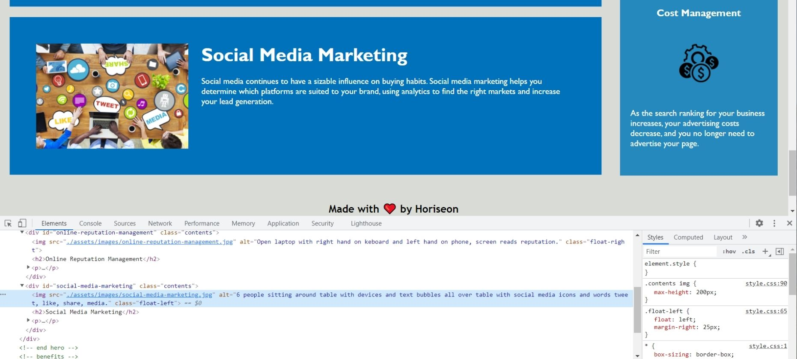
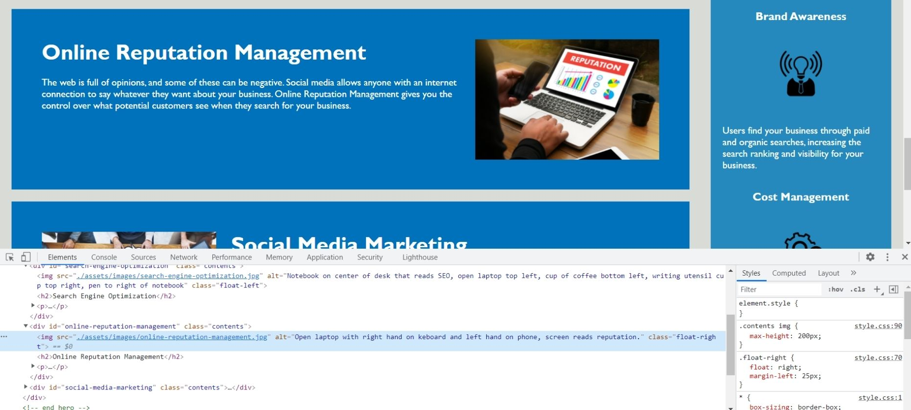
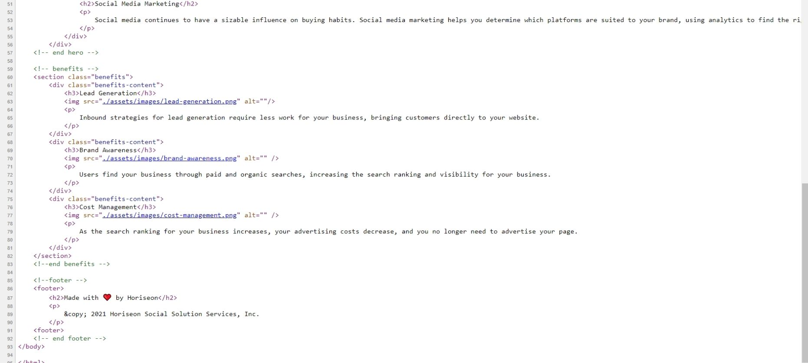
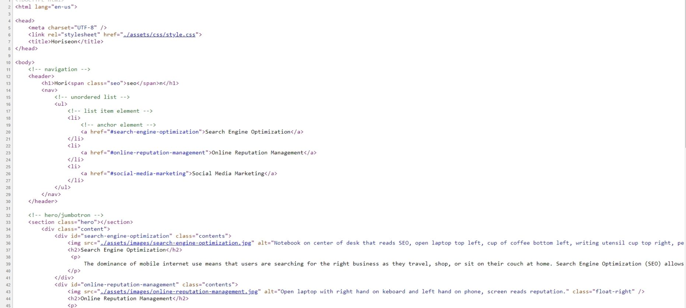

# Code Refactor for Horiseon Website for Challenge 1

### This challenge entails refactoring code for the Horiseon website in order for it to meet accessibility standards.  

### The following alt text has been added to the images in the website.

  

  

  

### The HTML and CSS files have been refactored to add comments and structure for improved organization.

  

  

  

### All feedback and contributions welcome!

### Thank you!

### Submitted by _Jamie Williams_ 

